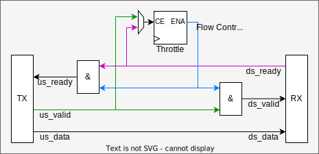

# AXI4 Streaming Library

## Table of Contents
* [References](#references)
* [Overview](#overview)
* [Handshaking and Reset Rules](#handshaking-and-reset-rules)
* [Best Practice](#best-practice)
* [Address Extension](#address-extension)
* [Package](#package)
  - [Types](#types)
  - [Reset and Default Values](#reset-and-default-values)
  - [Conversion](#conversion)
* [Modules](#modules)
  - [Pipelining](#pipelining)
  - [Upsizing](#upsizing)
  - [Downsizing](#downsizing)
  - [Arbiter](#arbiter)
  - [Demultiplexer](#demultiplexer)
  - [Packet Former](#packet-former)
  - [AXI4MM Conversion](#axi4mm-conversion)

## References

* [AMBA 4 AXI4-Stream Protocol Specification](https://developer.arm.com/documentation/ihi0051/a/?lang=en)

## Overview

This library includes types, functions, modules, etc. for AXI4 conform streaming from
a Transmitter (Master) to a Receiver (Slave).

## Handshaking and Reset Rules

The basic AXI handshaking and reset rules are described in the specification IHI0051, Chapters 2.2 and 2.8

* For a transfer to occur, both TVALID and TREADY must be asserted at the same rising ACLK edge.
  Either TVALID or TREADY can be asserted first, or both can be asserted in the same ACLK cycle.
* A Transmitter is not permitted to wait until TREADY is asserted before asserting TVALID.
  Once TVALID is asserted, it must remain asserted until the handshake occurs.
  The valid data bytes and control information from the Transmitter must remain unchanged once
  TVALID has been asserted by the Transmitter.
* In the ACLK cycle after a transfer the Transmitter must either deassert TVALID or present valid
  new data to the Receiver.
* A Receiver is permitted to wait for TVALID to be asserted before asserting TREADY.
  It is permitted that a Receiver asserts and deasserts TREADY without TVALID being asserted.
* The reset signal can be asserted asynchronously, but deassertion must be synchronous after the
  rising edge of ACLK.
* During reset, TVALID must be driven LOW. All other signals can be driven to any value.
* A Transmitter interface must only begin driving TVALID at a rising ACLK edge following a rising
  edge at which the reset is released.

## Best Practice

* Assert the outgoing TREADY and ignore the incoming TVALID during reset to flush the upstream pipeline.
* Adjust the data width to the actually required throughput and avoid an unnecessary wide bus
  with only few valid cycles. Upsize as late as possible and downsize as soon as possible.
  This will reduce FPGA resources required for routing and pipelining and most-likely makes
  it easier to meet the timing.
* Using a local transfer indication signal (e.g. is_transfer <= TVALID and TREADY) can make code
  more understandable.
  In the transmitter derive that signal directly from the stream output port and ensure that at least
  the valid signal is updated with every transfer.
  In the receiver derive that signal directly from the stream input port and ensure that the input is
  always taken over with each transfer.

## Address Extension

In some cases it is useful to provide a start address before a stream starts.
Therefore, an AXI4 streaming compatible but proprietary extension is available which is defined as follows:
The LSB of the TUSER signal defines whether TDATA carries data (TUSER(0)=0) or an address (TUSER(0)=1).

Similar to data transfers also address transfers can require multiple cycles, e.g. when the width of TDATA is smaller than the address width.
Address transfers shall be upsize/downsize compatible, hence they must start with the LSBs and end with the TLAST bit set.
The address transfer should typically be a header before the data but can also be a trailer to terminate
the previous data stream and set the start address for the next stream.

Interleaved streams with different IDs are supported as well since each address transfer is associated with a TID.
If for one TID multiple address transfers occur in a row without data transfers in-between then address information
is overwritten and only the last transferred address is relevant.

  

## Flow Control

AXI data transfers can be paused when the outgoing upstream ready signal towards the transmitter
and the outgoing downstream valid signal towards the receiver are pulled LOW at the same time.
Hence, if you gate both signals synchronously then you can throttle the data transfer rate.

  

1. Transmitter Throttle:
Use the incoming upstream valid signal as clock enable for the gate control logic.
Example: Assume that the receiver is always ready to accept data (ds_ready=1) and the gate control
logic output toggles with every clock enable.
Thus, the transmitter valid rate will be divided and slow down by 50%. 

2. Receiver Throttle:
Use the incoming downstream ready signal as clock enable for the gate control logic.
Example: Assume that the transmitter can always provide data (us_valid=1) and the gate control
logic output toggles with every clock enable.
Thus, the receiver request/ready rate will be divided and slow down by 50%. 

Consideration

* If the receiver is always ready to accept data (ds_ready=1) and the transmitter can always
  provide data (us_valid=1) then you can set a defined data rate based on the AXI clock frequency.
* The gates must be open if AXI pipeline flushing or pre-filling is required.

## Package

The [VHDL Package](./pkg.vhdl) includes useful types, constants, functions and procedures.

### Types

* type **axi4s** : record, unconstrained AXI4 streaming channel for any data width (source is the AXI master)
* type **a_axi4s** is array (integer range <>) of axi4s : General unconstrained AXI4 streaming vector type

### Reset and Default Values

* function **reset**(s: axi4s) return axi4s: Reset AXI4 streaming channel
* function **reset**(s: a_axi4s) return a_axi4s : Reset AXI4 streaming vector
* function **reset_axi4s**(...) return axi4s : Constant reset value of streaming channel with specific width of elements

### Conversion

* function  **length** : number of overall bits in the AXI4 stream record, including the valid (but without the ready)
* function  **to_record** : split a SLV into AXI4 streaming channel record elements
* function  **to_slv** : concatenate all AXI4 streaming channel record elements into a SLV
* function  **dest_id_resize** : Pad or trim TID or TDEST signal
* function  **user_resize** : Pad or trim TUSER signal.
* procedure **bypass** : Stream bypass with interface adjustments -> padding, trimming and some error checks.
                         (procedure expects variables as input and output)

## Modules

### Pipelining

### Upsizing

### Downsizing

### Arbiter

### Demultiplexer

### Packet Former

### AXI4S Master to AXI4MM Slave Conversion

This conversion is useful to write/read a continuous data block or stream to/from memory.
Only a start address is required before the block/stream begins, hence the AXI4S [Address Extension](#address-extension) is mandatory.

#### to_axi4mm_write

This module converts an AXI4S input stream into an AXI4MM write access (channels AW and W).
AXI4S and AXI4MM data width must be the same, hence typically you have to upsize or downsize
the AXI4S input to match the AXI4MM data width.
Efficient AXI4MM transfers require burst support, hence the input stream should be buffered and split into packets/bursts.
This module intentionally does not include any buffers because each use case requires a different buffering concept.
Hence, an additional AXI4S buffer should be placed at the input of this module, e.g. the axi4s.packet_former .

#### to_axi4mm_read

This module converts an AXI4S input stream into an AXI4MM read access (channel AR) and an AXI4MM read response (channel R) into an AXI4S output stream.

### AXI4MM Master to AXI4S Slave Conversion

Currently, there is no use case for such a conversion. Hence, the development of modules like **from_axi4mm_write** or **from_axi4mm_read** is deferred.