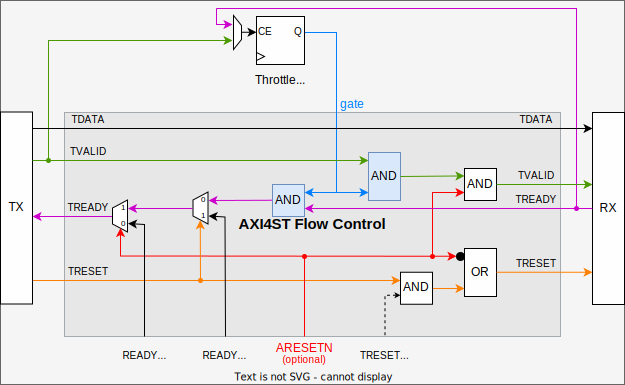

# AXI4 Streaming Library

## Table of Contents
* [References](#references)
* [Overview](#overview)
* [Handshaking and Reset Rules](#handshaking-and-reset-rules)
* [Best Practice](#best-practice)
* [Proprietary Extensions](#proprietary-extensions)
* [Package](#package)
  - [Types](#types)
  - [Reset and Default Values](#reset-and-default-values)
  - [Conversion](#conversion)
* [Modules](#modules)
  - [Pipelining](#pipelining)
  - [Upsizing](#upsizing)
  - [Downsizing](#downsizing)
  - [FIFO](#fifo)
  - [Flow Control](#flow-control)
  - [Arbiter](#arbiter)
  - [Demultiplexer](#demultiplexer)
  - [Packet Former](#packet-former)
  - [AXI4MM Conversion](#axi4mm-conversion)

## References
* [Wikipedia](https://en.wikipedia.org/wiki/Advanced_eXtensible_Interface)

* [AMBA 4 AXI4-Stream Protocol Specification](https://developer.arm.com/documentation/ihi0051/a/?lang=en)

## Overview

This library includes types, functions, modules, etc. for AXI4 conform streaming from
a Transmitter (Master) to a Receiver (Slave).
Each AXI module typically has two types of interface ports: 
* an **upstream** (slave) interface port, where an upstream transmitter (also called master, writer or provider) connects
* a **downstream** (master) interface port, where a downstream receiver (also called slave, reader or consumer) connects

## Handshaking and Reset Rules

The basic AXI handshaking and reset rules are described in the specification IHI0051, Chapters 2.2 and 2.8

* For a transfer to occur, both TVALID and TREADY must be asserted at the same rising ACLK edge.
  Either TVALID or TREADY can be asserted first, or both can be asserted in the same ACLK cycle.
* A Transmitter is not permitted to wait until TREADY is asserted before asserting TVALID.
  Once TVALID is asserted, it must remain asserted until the handshake occurs.
  The valid data bytes and control information from the Transmitter must remain unchanged once
  TVALID has been asserted by the Transmitter.
* In the ACLK cycle after a transfer the Transmitter must either deassert TVALID or present valid
  new data to the Receiver.
* A Receiver is permitted to wait for TVALID to be asserted before asserting TREADY.
  It is permitted that a Receiver asserts and deasserts TREADY without TVALID being asserted.
* The reset signal can be asserted asynchronously, but deassertion must be synchronous after the
  rising edge of ACLK.
* During reset, TVALID must be driven LOW. All other signals can be driven to any value.
* A Transmitter interface must only begin driving TVALID at a rising ACLK edge following a rising
  edge at which the reset is released.

## Best Practice

* Adjust the data width to the actually required throughput and avoid an unnecessary wide bus
  with only few valid cycles. Upsize as late as possible and downsize as soon as possible.
  This will reduce FPGA resources required for routing and pipelining and most-likely makes
  it easier to meet the timing.
* Using a local transfer indication signal (e.g. is_transfer <= TVALID and TREADY) can make code
  more understandable.
  In the transmitter derive that signal directly from the stream output port and ensure that at least
  the valid signal is updated with every transfer.
  In the receiver derive that signal directly from the stream input port and ensure that the input is
  always taken over with each transfer.
* If required, assert the outgoing READY and discard incoming valid data on the upstream side during
  reset to flush the upstream pipeline.
* Since (global) resets often cause timing issues avoid using them and use pipeline flushing instead.
  Only when an AXI module has internal memory that can't be reset by flushing mechanisms connect a reset.
  Here some examples:
  - Classic AXI pipeline registers can be flushed and do not necessarily need a reset.
  - Typically upsizing requires a reset but downsizing not.
  - AXI FIFOs can be flushed.

Here a VHDL template ...
```
  -- Ensure bubble free AXI operation and enforce upstream pipeline flushing during reset.
  us_ready <= (ds_ready or not ds_valid) or not aresetn;

  -- New upstream transfer will happen at the next clock edge.
  -- Data must be accepted because upstream transmitter will provide new data in next cycle.
  us_transfer <= us_ready and us_valid;

  process(aclk)
  begin
    if rising_edge(aclk) then
     if aresetn='0' then
       -- This optional AXI reset should be avoided and only be used carefully, e.g. to initiate
       -- AXI pipeline flushing. According to AXI standard pull the valid signal LOW during reset.
       ds_valid <= '0';
     else
       -- By default reset ds_valid when downstream receiver accepts data in the same cycle.
       -- Overwrite ds_valid below when new data is available.
       if ds_ready='1' then
         ds_valid <= '0';
       end if;

       -- Accept and process upstream data
       if us_transfer='1' then
         -- Here, take over upstream data and update ds_valid and ds_data dependent on new upstream data.
       end if;
     end if;
    end if;
  end process;
```

## Proprietary Extensions

In addition to the official AXI4 Streaming standard some more features are supported.

### Pipelined Reset

The pipelined active-high TRESET is useful to avoid timing issues with the global ARESETN.
The pipelined reset shall only be used when it is not possible to completely reset
a module with flushing mechanisms. For example, an upsize module typically needs
to reset internal states while a downsize module does not.
Note that standard pipeline registers typically do not require a reset because flushing is possible.

* The transmitter must ensure TVALID=0 when TRESET=1.
* TRESET shall not be gated with TVALID because in this case TRESET would not propagate downstream if TVALID is low.

### Item sizes other than a byte

According to the AXI4-Streaming specification an item is 8 bits (1 byte) wide.
However, this library allows any item width.
Each TSTRB/TKEEP bit corresponds to one item, hence the TDATA width must be a multiple of the TSTRB/TKEEP width.

### Number of items

The AXI4-Streaming specification defines/recommends a 2^n number of items (bytes) in TDATA
with e.g. downsize and upsize ratios being a power-of-2.
However, this library allows any positive integer number of items in TDATA and
therefore also any positive integer downsize or upsize ratio.
The width of the TSTRB and TKEEP signal defines the number of items.

### Auxiliary Signal

Sometimes the TUSER signal is not sufficient to add auxiliary information to the stream.
In addition to the TUSER signal also an optional auxiliary std_logic_vector can be attached to the standard AXI4_S record.
However, the handshaking of the attached auxiliary stream is bound to the related main AXI4 stream.
Any data can be mapped to this vector but not all AXI4 modules might support this feature.

### Address Extension

In some cases it is useful to provide a start address before a stream starts.
Therefore, an AXI4 streaming compatible but proprietary extension is available which is defined as follows:
The LSB of the TUSER signal defines whether TDATA carries data (TUSER(0)=0) or an address (TUSER(0)=1).

Similar to data transfers also address transfers can require multiple cycles, e.g. when the width of TDATA is smaller than the address width.
Address transfers shall be upsize/downsize compatible, hence they must start with the LSBs and end with the TLAST bit set.
The address transfer should typically be a header before the data but can also be a trailer to terminate
the previous data stream and set the start address for the next stream.

Interleaved streams with different IDs are supported as well since each address transfer is associated with a TID.
If for one TID multiple address transfers occur in a row without data transfers in-between then address information
is overwritten and only the last transferred address is relevant.

<div align="center">  </div>


## Package

The [VHDL Package](./pkg.vhdl) includes useful types, constants, functions and procedures.

### Types

* type **axi4_s** : record, unconstrained AXI4 streaming channel for any data width (source is the AXI transmitter/master)
* type **a_axi4_s** is array (integer range <>) of axi4s : General unconstrained AXI4 streaming vector type

### Reset and Default Values

* function **invalid**(s: axi4_s) return axi4s: Force invalid AXI4 streaming channel, TVALID=0 and TRESET=0
* function **invalid**(s: a_axi4_s) return a_axi4s : Force invalid AXI4 streaming channel, TVALID=0 and TRESET=0
* function **reset**(s: axi4_s) return axi4s: Reset AXI4 streaming channel, TVALID=0 and TRESET=1
* function **reset**(s: a_axi4_s) return a_axi4s : Reset AXI4 streaming vector, TVALID=0 and TRESET=1
* function **reset_axi4_s**(...) return axi4s : Constant reset value of streaming channel with specific item width

### Conversion

* function  **length** : number of overall bits in the AXI4 stream record, including the valid (but without the ready)
* function  **to_record** : split a SLV into AXI4 streaming channel record elements
* function  **to_slv** : concatenate all AXI4 streaming channel record elements into a SLV
* function  **dest_id_resize** : Pad or trim TID or TDEST signal
* function  **user_resize** : Pad or trim TUSER signal.
* procedure **bypass** : Stream bypass with interface adjustments -> padding, trimming and some error checks.
                         (procedure expects a variable as output)

## Modules

### Pipelining

Different pipeline stages are supported and can be combined as needed.
Dependent on the stage type the stage might require more resources and/or add logical levels to timing critical paths. 

Without pipeline register
* BYPASS: pass through all AXI signals without modifications
* DECOUPLE: The optional ARESETN can be used to decouple the downstream receiver from the upstream transmitter side.
  This is useful to flush AXI pipelines and avoid unstable ready and valid signals during reset.
  Upstream TREADY=1 enables upstream pipeline flushing.
  Forcing downstream TRESET=1 will inject the reset into the downstream pipeline.
  Forcing downstream TVALID=0 will inject invalid data into the downstream pipeline.

Not bubble-free, i.e. invalid data can remain in the pipeline stage
* SIMPLE: Pass through TREADY and use TREADY as clock enable for pipeline register.  
* GATING: Pass through TREADY and use TREADY and upstream TVALID as clock enable for pipeline register.
          Only valid data will be registered which reduces toggling rate and power consumption.

Bubble-free, i.e. pipeline stage removes cycles of invalid data
* PRIMING: Upstream TREADY will be 1 when downstream TREADY=1 and TVALID=0. (fill register until valid)
* PRIMEGATING: combination of PRIMING and GATING
* READY-BREAKUP: Add a pipeline register into the TREADY path to relax the timing of the TREADY path.
  Note that this requires a bit more complicated logic with registers and multiplexers also in the data path. 

### Upsizing

Upsize the upstream transmitter data width by an integer ratio (1,2,3,4,5,..) for downstream receivers with larger data width.

### Downsizing

Downsize the upstream transmitter data width by an integer ratio (1,2,3,4,5,..) for downstream receivers with smaller data width.

### FIFO

under construction ...

### Flow Control

AXI data transfers can be paused when the outgoing upstream ready signal towards the transmitter
and the outgoing downstream valid signal towards the receiver are pulled LOW at the same time.
Hence, if you gate both signals synchronously then you can throttle the data transfer rate.

<div align="center">  </div>

1. Transmitter Throttle:
Use the incoming upstream valid signal as clock enable for the gate control logic.
Example: Assume that the receiver is always ready to accept data (ds_ready=1) and the gate control
logic output toggles with every clock enable.
Thus, the transmitter valid rate will be divided and slow down by 50%. 

2. Receiver Throttle:
Use the incoming downstream ready signal as clock enable for the gate control logic.
Example: Assume that the transmitter can always provide data (us_valid=1) and the gate control
logic output toggles with every clock enable.
Thus, the receiver request/ready rate will be divided and slow down by 50%. 

Consideration

* If the downstream receiver is always ready to accept data (ds_ready=1) and the upstream transmitter
  can always provide data (us_valid=1) then you can define the data rate by dividing the AXI clock
  frequency in the flow control logic.
* The gates must be open if AXI pipeline flushing or pre-filling is required.

### Arbiter

under construction ...

### Demultiplexer

under construction ...

### Packet Former

under construction ...

### AXI4ST Transmitter/Master to AXI4MM Receiver/Slave Conversion

This conversion is useful to write/read a continuous data block or stream to/from memory.
Only a start address is required before the block/stream begins, hence the AXI4ST [Address Extension](#address-extension) is mandatory.

#### to_axi4mm_write

This module converts an AXI4ST input stream into an AXI4MM write access (channels AW and W).
AXI4ST and AXI4MM data width must be the same, hence typically you have to upsize or downsize
the AXI4ST input to match the AXI4MM data width.
Efficient AXI4MM transfers require burst support, hence the input stream should be buffered and split into packets/bursts.
This module intentionally does not include any buffers because each use case requires a different buffering concept.
Hence, an additional AXI4ST buffer should be placed at the input of this module, e.g. the axi4st.packet_former .

#### to_axi4mm_read

This module converts an AXI4ST input stream into an AXI4MM read access (channel AR) and an AXI4MM read response (channel R) into an AXI4ST output stream.


### AXI4MM Transmitter/Master to AXI4ST Receiver/Slave Conversion

Currently, there is no use case for such a conversion. Hence, the development of modules like **from_axi4mm_write** or **from_axi4mm_read** is deferred.
