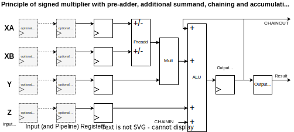
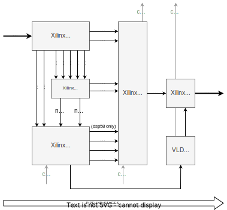

# SIGNED_PREADD_MULT1ADD1

This module multiplies two factors X and Y and adds one more summand Z. The input X includes a preadder XA+XB. 
Several results can be accumulated over time: `P = P + (XA+XB)*Y + Z`.
Furthermore, dynamic product negation and input negation are supported.
The module is the basis for many other modules like e.g.
* multiply accumulate
* dot product
* complex (vector) multiplication

Multiple instances of this module can be connected/chained in different ways to realize special operations.

## Overview

The following figure shows the abstract behavioral diagram of this module.
Note that all DSP internal pipeline registers are transformed into input registers
to demonstrate to concept. Implementation details are described further below. 

  

The additional output logic is mostly implemented in logic and allows optional
* shift-right and rounding
* clipping/saturation
* overflow detection
* additional output pipeline registers

## Xilinx/AMD

The Xilinx/AMD implementation is rougly as follows

  

NOTES
* At least 2 input register are recommended for XA, XB and Y.
* The ALU supports a maximum of 3 simultaneous summands. Input valid signals dynamically control the ALU operation.
  - The Multiplier output only contributes to ALU result when inputs (XA or XB) and Y are valid.
  - The Z input contributes when Z is valid.
  - The Chain input contributes when CHAININ is valid.
  - The Accumulator feedback contributes when CLR=0. Round bit is added when CLR=1 and rounding is enabled.
* If preadding is not required then only use XA and set XB invalid.
* In general, to save resources and to improve timing, ...
  - set entity generics according to your needs 
  - leave unused inputs unconnected/open or set constant invalid and zero 
  - feed control inputs with constants if dynamic operation is not required
  - leave unused ouptuts open or terminate with unused dummy signals
* Typically, DSP internal round bit addition is supported.
  If DSP internal round bit addition is not possible then the round bit is added within the output logic.
  - If accumulation is possible and enabled then the round bit is added to the accu register in the first accumulation cycle when the accu is cleared.
  - If accumulation is disabled then the round bit is added in the first chain link where the chain input is unused.

  

### DSP48E2

Reference: [Xilinx - UltraScale Architecture DSP Slice (UG579)](https://docs.amd.com/v/u/en-US/ug579-ultrascale-dsp)

The DSP48E2 is used in Ultrascale(+) devices and has the following features
* 27x18 Multiplication, 27-bit XA and XB, 18-bit Y
* 27-bit Preadder
* 48-bit wide Z input and accumulator/output register

### DSP58

Reference: [Xilinx/AMD - Versal ACAP DSP Engine (AM004)](https://docs.amd.com/r/en-US/am004-versal-dsp-engine)

With Versal ACAP the DSP58 has been introduced. The main changes to the previous DSP48E in respect to this module are
* 27x24 Multiplication, 27-bit XA and XB, 24-bit Y
* additional product negation within multiplier
* 58-bit wide Z input and accumulator/output register
